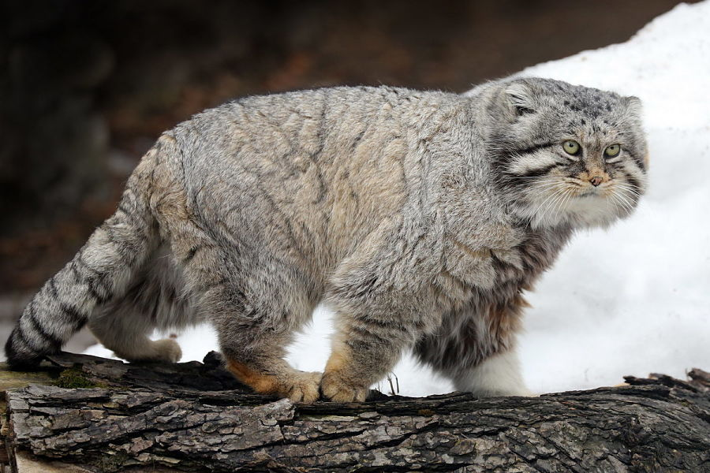
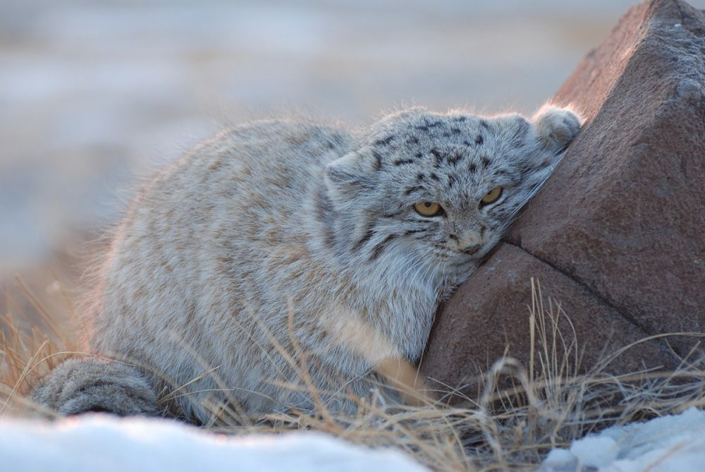
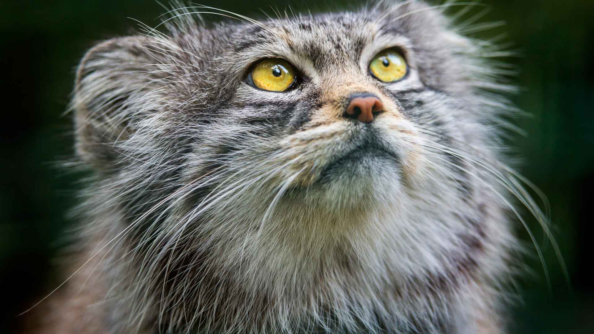
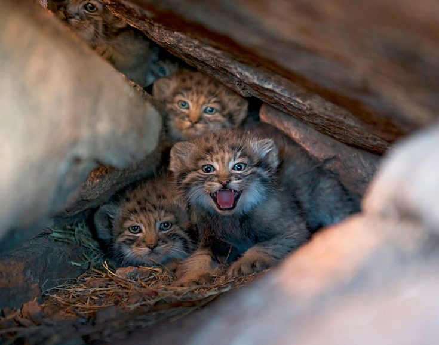
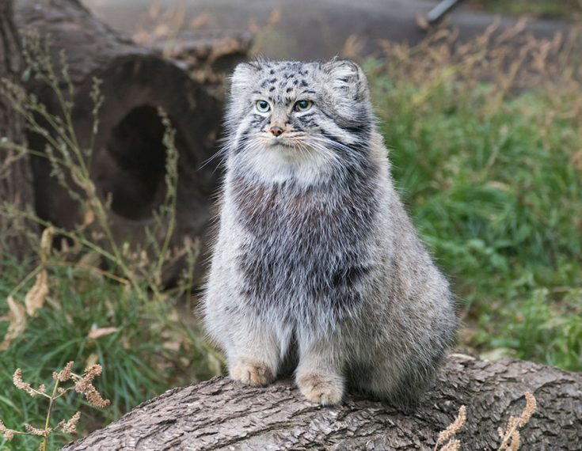
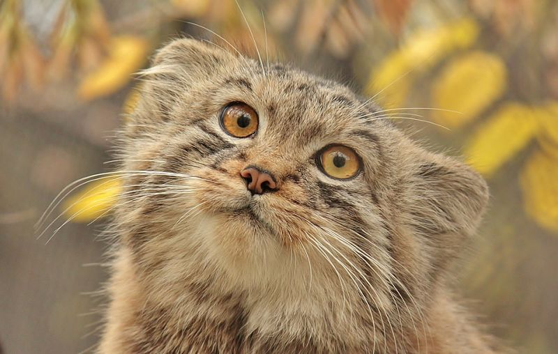

<!DOCTYPE html>
<html lang="en">
<head>
    <meta charset="UTF-8">
    <meta http-equiv="X-UA-Compatible" content="IE=edge">
    <meta name="viewport" content="width=device-width, initial-scale=1.0">
    <link rel="stylesheet" href="style.css">
    <title>Manul</title>
</head>
<body>

    <header>
        <h1 id="header1">Манул</h1>
    </header>

    <nav class="menu">
        <a href="https://faunistics.com/manul/">faunistics.com</a> |
        <a href="https://vsezhivoe.ru/manul/">vsezhivoe.ru</a> |
        <a href="https://animaljournal.ru/article/jivotnoe_manul">animaljournal.ru</a> |
    </nav>

    <main>  
        <section>

            
Этот кот стал известен всему миру благодаря немецкому натуралисту <b>Питеру Палассу</b>. Он обнаружил существование этого зверя в 1776 году в бассейне Каспийского моря. Благодаря данному факту, это животное имеет еще одно название – палассов кот, хотя кот имеет два научных названия, при этом одно из них в переводе из греческого означает «уродливое ухо», что вызывает некоторое недоразумение.

            <h2>Внешний вид</h2>
            

                
            

            

                Кошка Палласа по размерам сопоставима с домашними кошками. Длина тела животного составляет от 46 до 65 см, длина хвоста от 21 до 31 см. Вес кота в среднем от 2,5 до 4,5 кг. Животное отличается коренастым телосложением, короткими лапами и густым длинным мехом, поэтому внешне кот кажется более плотным и массивным, чем есть на самом деле. У манула самая густая шерсть из всех кошачьих — на 1 квадратный сантиметр приходится до 9000 волосков, длиной до 9 см каждый.
            

            

                Окрас животного варьируется от светло-серого до темного-желтого, с вертикальными темными полосами на туловище и передних лапах. Зимой мех более серый, и с менее выраженными полосками, чем летом. на кончиках волосы окрашены в белый цвет, что придает шкуре припорошенный снегом вид. На хвосте отчетливо видны темные кольца, на лбу — темные пятнышки. На щеках горизонтальные темные полоски идут от уголков глаз в сторону. Темные и белые круги вокруг глаз подчеркивают их круглую форму. На подбородке и горле светлый мех, который  плавно перетекает в светло-серый на брюхе.
            

            

                

                    <b>Интересный факт:</b> У дикого кота манула просто уникальная пушистость, если ее сравнить с пушистостью остальных кошачьих. Кроме того, что высота шерстинок составляет до 7 см, их плотность на теле животного просто поражает – до 9 тысяч единиц на 1 см квадратный.
                

            

            

                Лапы у манула пропорционально самые короткие среди всех Кошачьих. Уши очень маленькие, и низко посаженные и достаточно широко раставленные. Морда заметно короче, чем у других кошек, поэтому кажется, что зверь смотрит исподлобья. Из-за короткой челюсти у кота меньше зубов, чем у других диких кошек, но длинные клыки сохранились. У животного короткие когти, и необычные круглые зрачки, по сравнению с другими Кошачьими.
            

            

                В пасти кота манула растет не 30, а 28 зубов, при этом клыки в 3 раза длинней, нежели у обычных домашних котов. Конструкция глаз также имеет некоторое отличие, поскольку в ней предусмотрено третье веко, оберегающее глаза от пересыхания, а также от механических повреждений. У этого дикого зверя очень внимательный и настороженный взгляд. Глаза у животного сравнительно большие, желто-зеленого окраса. От них исходит по две черные полосы, после чего они проходят по щекам. Заканчивается одна из полос у основания уха, а вторая полоса заканчивается на шее.
            

        </section>
       <section>
           <h2>Характер и образ жизни</h2>
           

            
           

           

            Манул, как и другие дикие кошки, ведет одиночный и оседлый образ жизни. У каждого животного есть собственная территория, которую они помечают запаховыми метками. Размер собственного участка варьируется в зависимости от места обитания и кормовой базы, но не более 10 квадратных километров на 1 хищника.
           

           

            Несмотря на суровый внешний вид, манул не агрессивен. Врагов у манула практически нет, лишь волки и крупные хищные птицы представляют опасность для этого дикого кота. Животное манул не из тех, кто спешит учинять разборки и дать отпор врагу. Этот кот старается ретироваться бегством и залечь в укрытии. Но когда манула застали врасплох и отходных путей в убежище нет, тогда он начинает грозно фыркать и обнажает свои острые зубы.
           

           

            Днем животные отдыхают в пещерах, каменистых россыпях, бывших логовах сурков и лисиц, на рассвете и ближе к вечеру выходят на охоту. Коты охотятся на добычу из засады, или незаметно подкрадываются, используя для укрытия камни и заросли кустарника. Окрас животного отлично маскирует его среди снега и камней.
           

           

            Покидая свое логово, животное уходит от него не больше, чем на 1 км, при этом он исследует близлежащие территории. Способ передвижения имеет некоторое сходство с лисьим, поскольку кот идет по прямой линии и, след в след, при этом интервал между следами более короткий и составляет не больше 15 сантиметров.
           

           

            Манулы самые неповоротливые и медленные из всех диких кошек. Они не приспособлены к бегу, и гонятся за добычей, полагаясь исключительно на внезапные нападения из засады. В случае опасности они затаиваются, маскируясь на фоне камней, и взбираются на скалы.
           

       </section>
       <section>
           <h2>Чем питается манул?</h2>
           

               
           

           

            Манул питается преимущественно пищухами, небольшими птицами (азиатская горная куропатка), и мышами (когтистая песчанка, полевка). Пищуха — небольшое животное, принадлежащее к зайцеобразным, размером с хомяка. Реже Палласов кот охотится на зайцев-толаев, сусликов и молодых сурков. В летний период, когда пищух мало, кошка активно ест насекомых — кузнечиков, саранчу и т.д.
           

           <b>Основную массу рациона питания составляют:</b>
           <ul>
               <li>Полевки и песчанки.</li>
               <li>Хомячки и суслики.</li>
               <li>Зайцы-толаи.</li>
               <li>Мелкие (молодые) сурки.</li>
               <li>Пищухи.</li>
               <li>Куропатки и кеклики.</li>
               <li>Жаворонки, а также другие птицы, обустраивающие свои гнезда на земле.</li>
               <li>Многие виды насекомых, что характерно для летнего периода.</li>
           </ul>
           

            Манул ловит свою добычу хитростью. Он дожидается ее у норы или караулит жертву притаившись у камней, после чего нападает, совершая резкий бросок. Этот дикий кот очень осторожен на охоте. Манул не способен быстро бегать, поэтому погоня за добычей – не его конек.
           

           

               

                <b>Интересный момент:</b> С наступлением осени у манулов отмечается резкое увеличение аппетита. В этот период животное начинает есть почти в 2 раза больше, что приводит к быстрому набору веса. В середине зимы, аппетит, наоборот, практически пропадает, и животное кормится от случая к случаю и то через день.
               

           

           

            Когда этот зверь находится в зоопарке, то их основу рациона составляет мясо, в сочетании с различной зеленью, а также костной мукой. При этом у кота имеется любимое лакомство, состоящее из тушек грызунов и перепелов, которых специально разводят в зоопарках. Как правило, этих животных кормят с наступлением вечера.
           

       </section>
       <section>
           <h2>Размножение и потомство</h2>
           

               
           

           

            Эти животные размножаются 1 раз в год, при этом начало периода размножения приходится на февраль/март месяцы. Этот период характеризуется определенными звуками, которые издают самцы. Эти звуки чем-то напоминают тихий лай или совиный крик. Самка способна оплодотвориться в течение двух суток. Как правило, находится сразу несколько взрослых самцов, которые затевают жестокие поединки, борясь за право оплодотворения самки.
           

           

            После спаривания, самка вынашивает свое потомство на протяжении 2-х с половиной месяцев, а в среднем – около 2-х месяцев. В апреле/мае/июне месяце на свет появляются пятнистые котята. В среднем, на свет появляется около 4-х детенышей, хотя их количество может быть разным и насчитывать от 1 до 7 котят.
           

           

            Самки рожают в логове, выстланном сухой травой, перьями и шерстью. В качестве логова используются расселины, небольшие пещеры, старые норы сурков, барсуков, лисиц. Котята рождаются весом всего около 90 граммов, слепые и беспомощные, покрытые густым пушистым мехом, который сменяется полноценным взрослым мехом уже в возрасте 2 месяцев. С 4 месяцев детеныши начинают охотится, в 6 месяцев достигают размеров взрослой кошки и начинают самостоятельную жизнь. Половая зрелость у манула наступает после 10 месяцев.
           

       </section>
       <section>
           <h2>Естественные враги и угрозы</h2>
           

               
           

           

            На манула часто охотятся волки и филины. Кроме того, в молодом возрасте животное очень подвержено инфекционным заболеваниям. Серьезной угрозой для зверя являются снежные зимы и продолжительный гололед, а также сокращение кормовой базы — уменьшение популяции грызунов, пищух и прочей добычи.
           

           

            У дикого кота манула достаточное количество естественных врагов, в том числе и пищевых конкурентов, представленных хищными пернатыми, обыкновенной лисой и т.д.
           

           <b>К природным врагам кота манула следует отнести:</b>
           <ul>
               <li>Волков, которых особенно много в последнее время.</li>
               <li>Собак, как пастушьих, так и бродячих.</li>
               <li>Соколообразных птиц.</li>
               <li>Филинов.</li>
               <li>Браконьеров.</li>
           </ul>
           

            Кот манул не отличается стремительностью и быстротой перемещения, поэтому ему непросто уйти от целенаправленного преследования. Если его застать врасплох, то, как правило, ему приходится расстаться со своей жизнью.
           

       </section>
       <section>
           <h2>Популяция и статус вида</h2>
          
           

            Точную численность животных подсчитать сложно из-за труднодоступности их ареала обитания и отличной маскировке, однако количество кошек повсеместно сокращается. По данным на начало 2000-ых, в России оставалось от 3 000 до 3650 дальневосточных особей, из них большая часть приходилась на Читинскую область.
           

           

            Дикий кот занесен в Красную книгу МСОП как «вид, вызывающий наименьшие опасения», и внесен в Красную книгу России. Охота на манула запрещена во всех странах его ареала обитания, кроме Монголии.
           

           

            
        

           

            Если манул своевременно увидит человека, то он легко может спрятаться или просто затаиться на местности, благодаря уникальной расцветке своего шерстяного покрова, который буквально сливается с окружающей природой.
           

           

               

                <b>Важный момент!</b> Благодаря такой способности маскироваться на местности, ученые до сих пор не могут определить точную численность этих животных из-за сложностей в его изучении, как вида.
               

           

           

            По мнению ученых-биологов, на начало столетия в нашей стране насчитывалось от 3-х до 3-х с половиной тыс. особей. По их мнению, общая численность этих животных постоянно сокращается. <b>Уменьшение популяции кота манула связано:</b>
           

           <ul>
               <li>С деятельностью браконьеров.</li>
               <li>С массовой охотой на других животных.</li>
               <li>С беспривязным содержанием домашних собак.</li>
               <li>С недостатком кормовой базы.</li>
               <li>С многоснежными зимами.</li>
               <li>С различными инфекционными заболеваниями.</li>
           </ul>
           

               

                   <b>Важный момент!</b> Специалисты отмечают тот факт, что многие природные места обитания кота манула стали недостижимыми для человека, что вселяет, хотя и небольшую, но надежду на то, что эти уникальные животные не исчезнут, как вид.
               

           

           

            С 2013 года дальневосточного манула изучают в Даурском национальном заповеднике в рамках программы Русского географического общества по сохранению манула в Забайкалье. Основные цели программы — изучение природных мест обитания и миграций животного, а также измерение уровней выживаемости котят и взрослых особей.
           

           

            По состоянию на 2010 год, в зоопарках по всему миру содержалось 47 особей. Манулы неплохо размножаются в неволе, однако они сильно подвержены болезням из-за недостаточно развитой иммунной системы. В дикой природе среда обитания животных ограничена, и за ее пределами животные страдают от вирусов, которых нет в их естественной среде высокогорья и степей.
           

       </section>
    </main>

    <footer>
        

            Итак, пару слов об этом сайте.
        

        

            Начать хотелось-бы с того, что он является некой "солянкой" из сайтов. Т.е информацию в любом случае выбирал я, но это не оправдывает то, что информация не моя). Но мне будет безумно приятно услышать то, что этот сайт кому-то понравился.
        

    </footer>
</body>
</html>
